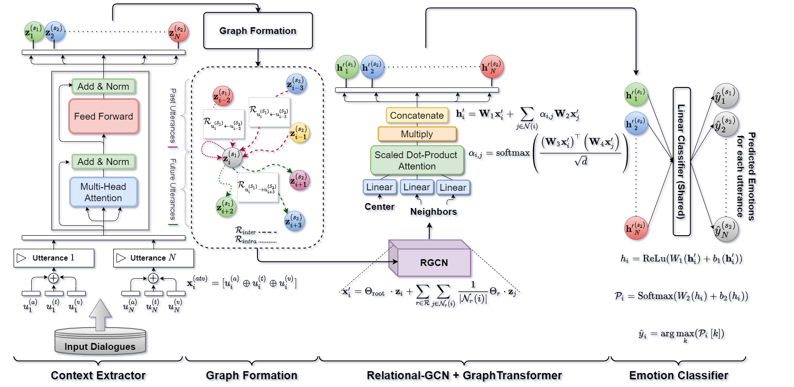

## COGMEN; Official Pytorch Implementation

**Note**
> this has been edited by mina and hirona for cs662 :))))))))

**CO**ntextualized **G**NN based **M**ultimodal **E**motion recognitio**N**

**Picture:** *COGMEN Model Architecture*

This repository contains the official Pytorch implementation of the following paper:
> **COGMEN: COntextualized GNN based Multimodal Emotion recognitioN** 

> **Paper:** https://arxiv.org/abs/2205.02455

> **Authors:** Abhinav Joshi, Ashwani Bhat, Ayush Jain, Atin Vikram Singh, Ashutosh Modi 
>
> **Abstract:** *Emotions are an inherent part of human interactions, and consequently, it is imperative to develop AI systems that understand and recognize human emotions. During a conversation involving various people, a person’s emotions are influenced by the other speaker’s utterances and their own emotional state over the utterances. In this paper, we propose COntextualized Graph Neural Network based Multimodal Emotion recognitioN (COGMEN) system that leverages local information (i.e., inter/intra dependency between speakers) and global information (context). The proposed model uses Graph Neural Network (GNN) based architecture to model the complex dependencies (local and global information) in a conversation. Our model gives state-of-theart (SOTA) results on IEMOCAP and MOSEI datasets, and detailed ablation experiments
show the importance of modeling information at both levels*

## Requirements

- We use PyG (PyTorch Geometric) for the GNN component in our architecture. [RGCNConv](https://pytorch-geometric.readthedocs.io/en/latest/modules/nn.html#torch_geometric.nn.conv.RGCNConv) and [TransformerConv](https://pytorch-geometric.readthedocs.io/en/latest/modules/nn.html#torch_geometric.nn.conv.TransformerConv)

- We use [comet](https://comet.ml) for logging all our experiments and its Bayesian optimizer for hyperparameter tuning. 

- For textual features we use [SBERT](https://www.sbert.net/).
### Installations
- [Install PyTorch Geometric](https://pytorch-geometric.readthedocs.io/en/latest/notes/installation.html)

- [Install Comet.ml](https://www.comet.ml/docs/python-sdk/advanced/)
- [Install SBERT](https://www.sbert.net/)

## Preparing datasets for training

        python preprocess.py --dataset="iemocap_4"

## Training networks 

        python train.py --dataset="iemocap_4" --modalities="atv" --from_begin --epochs=55

## Run Evaluation 

        python eval.py --dataset="iemocap_4" --modalities="atv"

Please cite the paper using following citation:

## Citation
    @inproceedings{joshi-etal-2022-cogmen,
    title = "{COGMEN}: {CO}ntextualized {GNN} based Multimodal Emotion recognitio{N}",
    author = "Joshi, Abhinav  and
      Bhat, Ashwani  and
      Jain, Ayush  and
      Singh, Atin  and
      Modi, Ashutosh",
    booktitle = "Proceedings of the 2022 Conference of the North American Chapter of the Association for Computational Linguistics: Human Language Technologies",
    month = jul,
    year = "2022",
    address = "Seattle, United States",
    publisher = "Association for Computational Linguistics",
    url = "https://aclanthology.org/2022.naacl-main.306",
    pages = "4148--4164",
    abstract = "Emotions are an inherent part of human interactions, and consequently, it is imperative to develop AI systems that understand and recognize human emotions. During a conversation involving various people, a person{'}s emotions are influenced by the other speaker{'}s utterances and their own emotional state over the utterances. In this paper, we propose COntextualized Graph Neural Network based Multi- modal Emotion recognitioN (COGMEN) system that leverages local information (i.e., inter/intra dependency between speakers) and global information (context). The proposed model uses Graph Neural Network (GNN) based architecture to model the complex dependencies (local and global information) in a conversation. Our model gives state-of-the- art (SOTA) results on IEMOCAP and MOSEI datasets, and detailed ablation experiments show the importance of modeling information at both levels.",}

## Acknowledgments
The structure of our code is inspired by [pytorch-DialogueGCN-mianzhang](https://github.com/mianzhang/dialogue_gcn).
